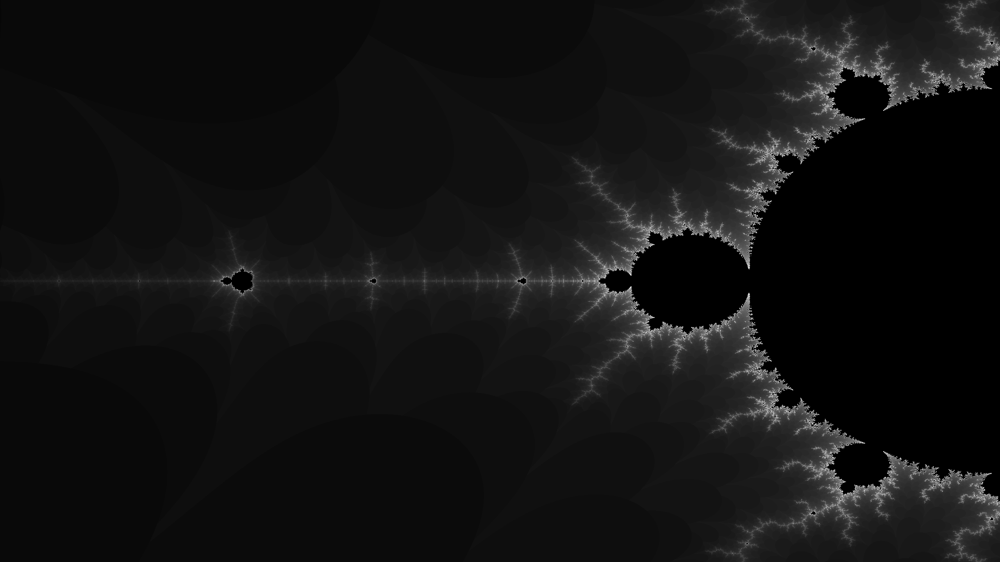

# Go Mandelbrot



Just a toy project used to explore the magic of the [Mandelbrot set](https://en.wikipedia.org/wiki/Mandelbrot_set) ; )

There are other "_real_" implementations available, with a richer set of capabilities, for generating Mandelbrot sets and this is only a simple experimentation for the sake of it.

The novel [Cryptonomicon](https://en.wikipedia.org/wiki/Cryptonomicon), by Neal Stephenson, includes a great description of the
beauty and history of the Mandelbrot set, which inspired me to want to code it up myself since... 
"_If you can't explain it, you don't really understand it!_"

Obviously Golang is not the first choice for such graphical pursuits, but it is currently the language I use on a daily basis,
and does bring good performance and concurrency.  It seemed like a fun challenge to see what I could do with it.

## Usage

Simply build and use...
```shell
# Build It
go build mandelbrot.go

# Generate Default Image (mandelbrot.png)
./mandelbrot

# Generate Custom Image
./mandelbrot -config=config.yaml -image=my-mandelbrot.png
```

## Configuration

The config file contains the following which allow different areas and depths of the Mandelbrot image to be rendered...
```yaml
mandelbrot:               # Fields related to the mandelbrot calculation
  escapeThreshold: 4.0    # The value which must be exceeded to consider a point as "escaped" to infinity and outside the set.
  maxIterations: 100      # The number of iterations to check for escape
  parallelism: 16         # The number of parallel Go Routines to use
image:
  xCoordinateMin:  -2.25  # Min X coordinate on the cartesian plane defining the scope of the image.
  xCoordinateMax:  0.75   # Max X coordinate on the cartesian plane defining the scope of the image.
  yCoordinateMin:  -1.1   # Min Y coordinate on the cartesian plane defining the scope of the image.
  yCoordinateMax:  1.1    # Max Y coordinate on the cartesian plane defining the scope of the image.
  canvasWidth:     2560   # The width of the image file to be generated.
  canvasHeight:    1440   # The height of the image file to be generated.
```

## Future Enhancements

- Add gradient coloring... currently only grayscale
- Test out various efficiency permuations
- Automate the generation and animation of a sequence of frames (zooming into the set!)
- etc...
